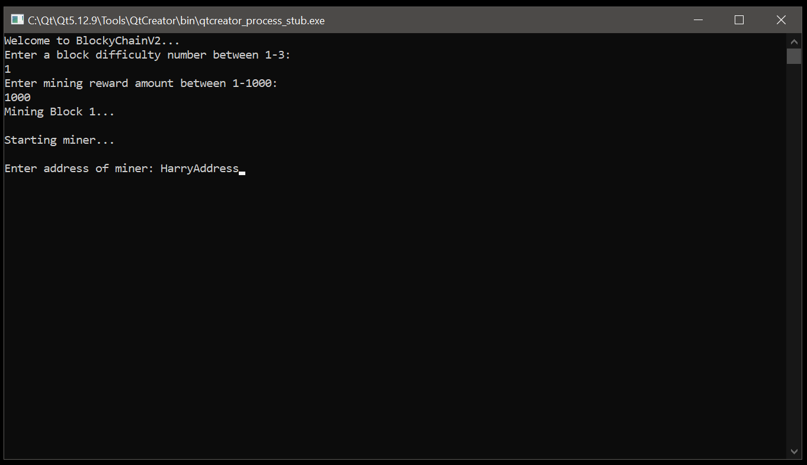
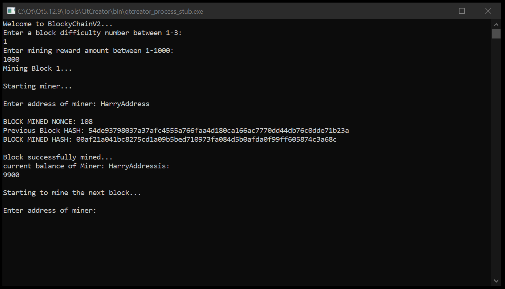
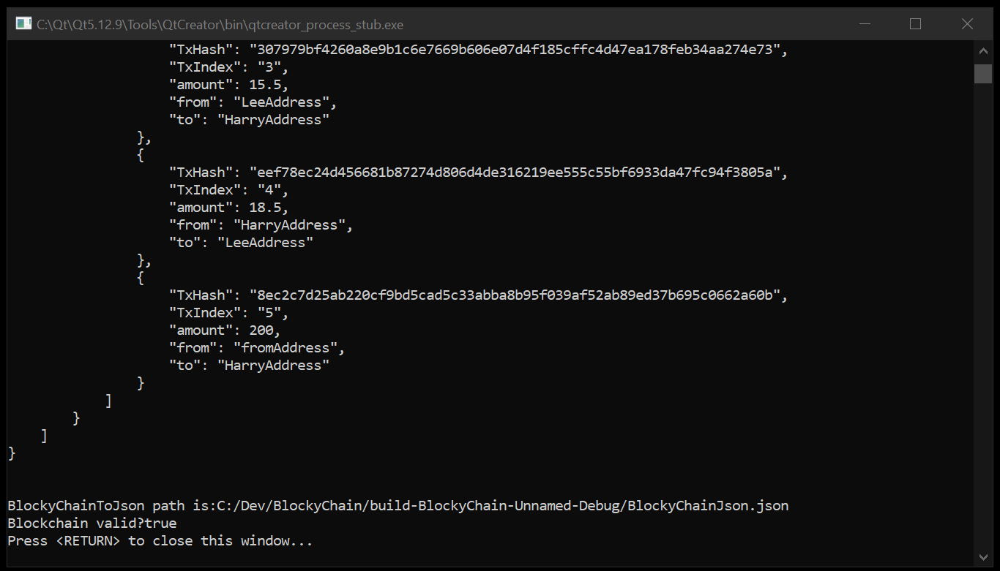
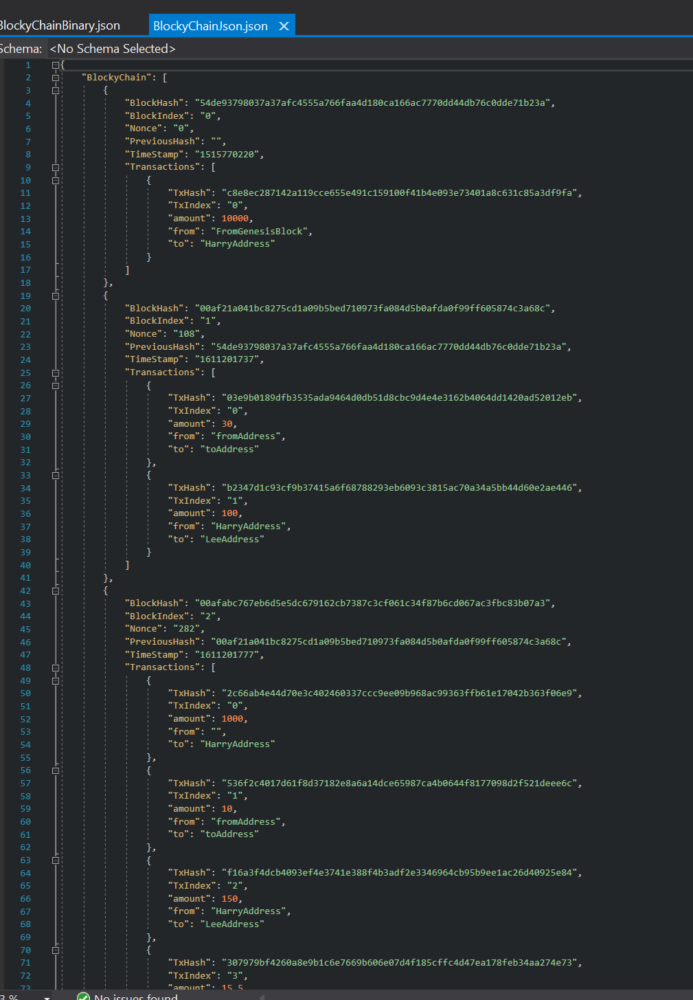
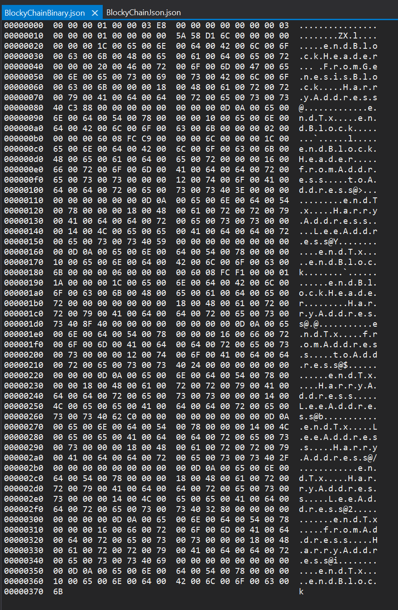

# BlockyChain

This repo includes BlockyChain v1 in a seperate file. V1 was a very simple project that was a start to see the bare fundamentals of developing a blockchain. 
The first version has the ability to mine a hardcoded amount of blocks. The difficulty is also hardcoded but can be adjusted to see proof of concepts. After the first one 
I wanted to add in more features and slowly build another one from the ground up that is slightly more complex with more functionality. 

#BlockyChainV2

BlockyChain V2 is a complete rework of version one, which showed me the fundamentals. In version 2 I have included adjustable mining difficulty which is based on the same hashing algo that BTC uses, the Merkle tree. The Merkle tree shows some downsides which have been addressed in 'Block.cpp'. This means that that data is secured more effectively and efficiently.
I have also implemented a working difficulty changer for mining along with the ability to change mining rewards. These both have hardcoded limits for the application as making it too difficult could mean demoing the code may take extremely long. Other changes with mining include setting different miners addresses for different blocks, yet the rewards stay consistent.

Mining changes were not the only upgrades! The new Blockchain can also have multiple transactions in each block and will keep tabs on miners current balances.
If the code or the block is modified in any way when there is already a current chain, it will inform the user that the current chain is in valid. It will still show the chain but it will not be a valid chain.

The chain will be shown to the user in the console, but it will also provide a .json file with the current chain in correct Json formatting, along with a binary file with the same data. When booting up the application you have the ability to fetch the current chain or start a new one. If a new one is started I would recommend deleting the old json files just to be sure. 
These files are called: “/BlockyChainJson.json” & "/BlockyChainBinary.json". Be sure to have a look at both of these files if you want to see everything. It's also a bit easier to read than the console output. 

